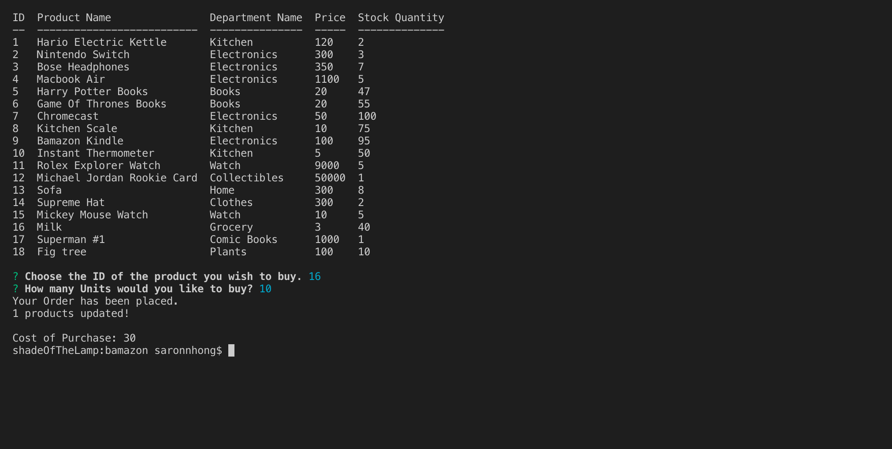
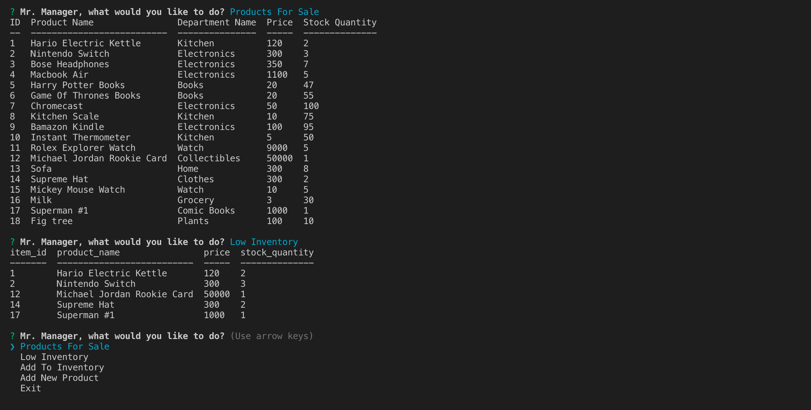
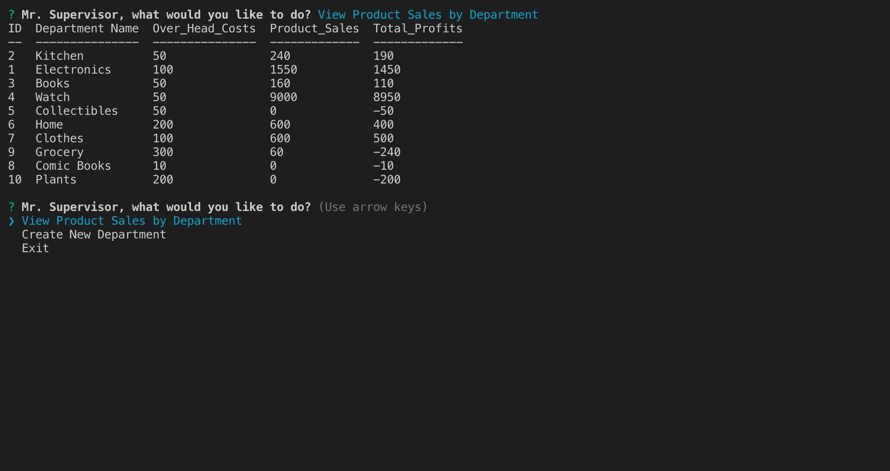

# bamazon

## Overview
BAmazon is an Amazon-like storefront. The Customer app takes orders from the customers and depletes the stock from inventory. The Manger app is able to view the products that are available for sale, check items that are low in inventory, add to the inventory, and add new products to the store front. The Supervisor app is able to keep track of the sales and profit for each department and be able to add new departments.

## Usage
The BAmazon app runs in the Terminal window. User must install the Inquirer, MySQL, and Console Table NPM packages before being able to run the application. User must type "node bamazonCustomer.js", "node bamazonManager.js", or "node bamazonSupervisor" to start one of the applications. User will then be prompted on what they would like to do.

### The Apps:
* Customer View: Displays a list of items available on the BAmazon store front. User is able to select which item and quantity they would like to purchase. The store front's inventory is updated. Customer recieves a bill for the cost of the purchase. 
* Manager View: Display a list of all products available for sale. Managers are able to check which items have low inventory, add more to the inventory, and add new products to the store front.
* Supervisor ViewL Display a table of the Product Sales results for each department. Supervisor is able to see the Product Sales, Over head costs, and Total Profits of each department. Supervisor is able to create new departments and have it displayed with the other departments.

## Examples
### Images:

Screenshot of the BAmazon Customer app

Screenshot of the BAmazon Manager app

Screenshot of the BAmazon Supervisor app

### Video:
* [Demo](https://youtu.be/-OHJib2HmZY)

## Technologies
The BAmazon app was created using these technologies
* JavaScipt
* Node.js
* Inquirer NPM Package
* MySQL

## GITHUB
[github link](https://github.com/saronnhong/bamazon)

## My Role
My role in the app development was to create the BAmazon app based on instructions from UCSD Extension Full Stack Bootcamp. 
 